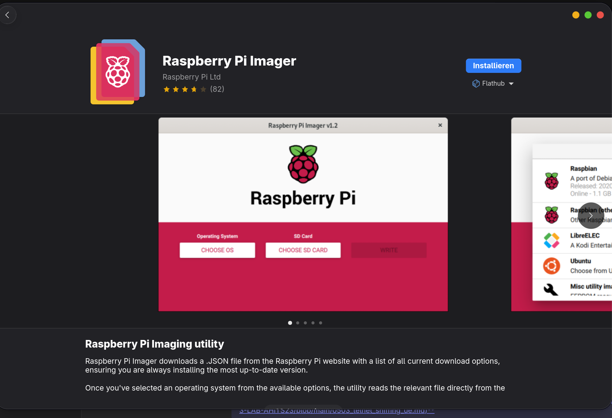

# Arbeitsbericht
 
**Fach: ITSE**
 
**Thema: Telnet**
 
**Name: Mate Szvercseg und Alexander Schauer**
 
**Klasse: 4AHITS**
 
**Datum: 02.10.2026**
 
**Aufgabenstellung: [01_rpi](https://github.com/HTL-Braunau-probst/ITPI-4/blob/main/0101_rpi.md)**

## Vorbereitung
 - Rasperberrypie Image Herunterladen
 

##  Start

**Aufgabenstellung:**
- Konfiguriere ein passendes Tastaturlayout
- Konfiguriere so, dass der RPi die IP Adresse per DHCP bezieht.
- Setze einen eindeutigen Hostnamen.
- Sicherheitsmaßnahme: Es soll kein Login mit Default Login Daten möglich sein.
- Auf den RPi soll per SSH zugegriffen werden können. Konfiguriere weiters Login per SSH keys.

**Was haben wir gemacht?**  

im Imager
- Raspberry Pi 3 Board auswählen 
- RPI OS 64 Bit auswählen
- Speichermedium: Internal SD-Card medium
- Hostname auswählen, unser Hostname: Berta
- **Lokalisierung:** 
  - Hauptstadt: Vienna 
  - Zeitzone: Europe/Vienna 
  - Tastatur Layout: AT
- Benutzername: berta
- Passwort: berta123
- WLAN: Überspringen -> Wir verwenden LAN
- SSH: Aktivieren -> Passwort zu authentifizierung verwenden
- Rasberry Pi Connect: nicht aktivieren
- Image: schreiben

## Remote Desktop

**Aufgabenstellung:**
- Teste die Erreichbarkeit des RPi im Schulnetz per ping und ssh.
- Arbeite nun weiter mit einer Kali VM auf einem Schulrechner. Teste auch hier die Verbindung zum RPi.
- Konfiguriere Remote Desktop: Es soll von der Kali VM aus die GUI des RPi dargestellt werden können. Das Ziel dabei ist in weiterer Folge auf die eigenen Tastatur und Monitor am RPi verzichten zu können.

## Remote Development
**Aufgabenstellung:**  
Konfiguriere Visual Studio Code (sollte bei Kali schon installiert sein – zum Test code in der shell eingeben) zum remote development auf dem Raspberry Pi. Dabei verwendet man VS Code unter Kali als Editor, ist aber per SSH mit dem RPi verbunden und editiert die Dateien dort, das in VS Code integrierte Terminal ist ebenfalls mit dem RPi verbunden.

Folge z.B. dem Tutorial unter Visual Studio Code: Remote development over SSH. Hinweis: Azure ist nicht notwendig weil wir einen RPi als remote machine haben.

Bringe den im Totorial beschriebenen Node JS express Server zum laufen.